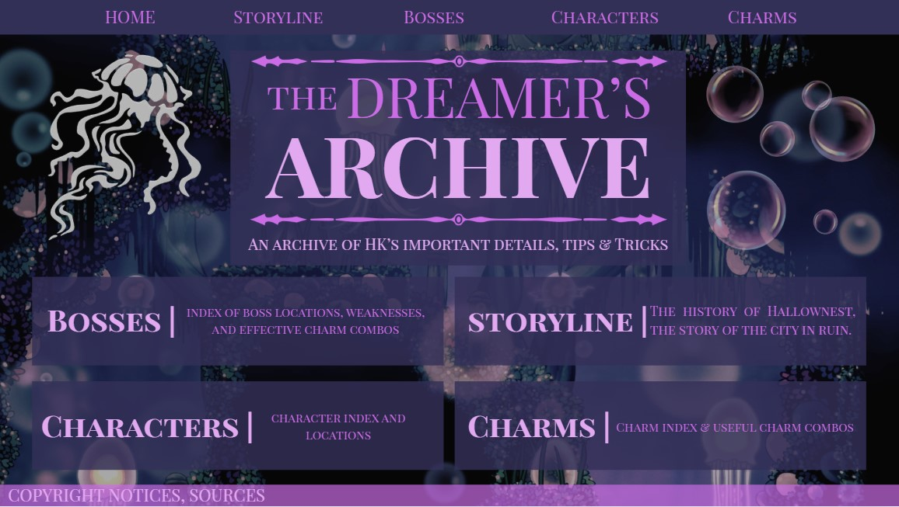
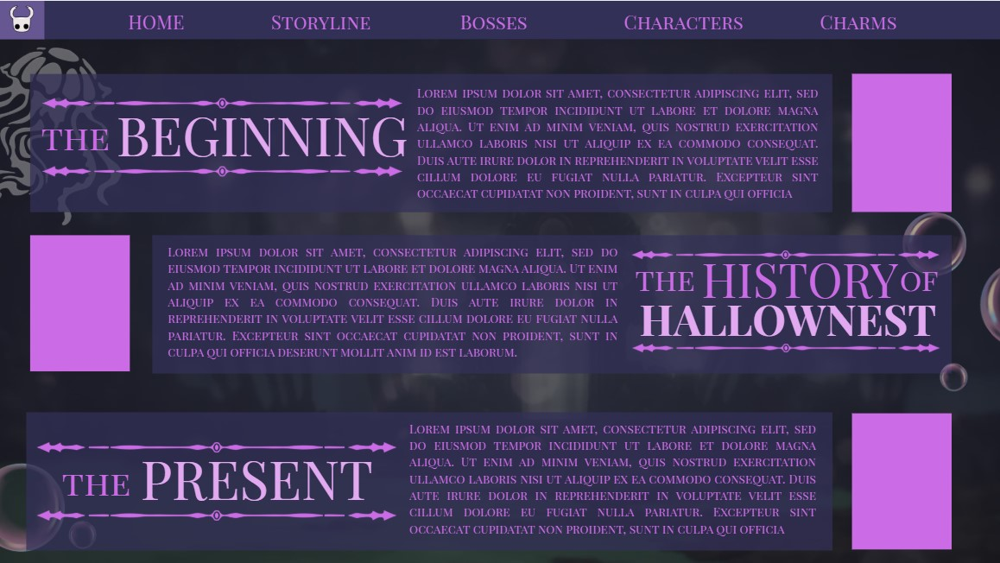
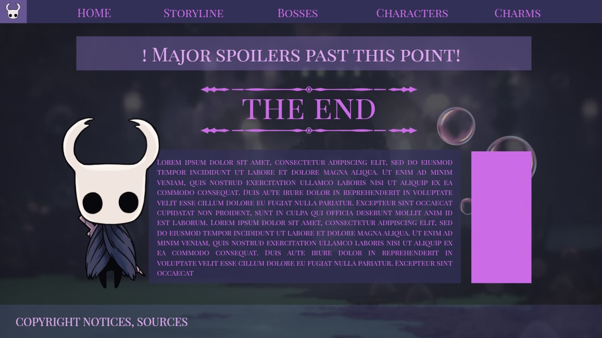
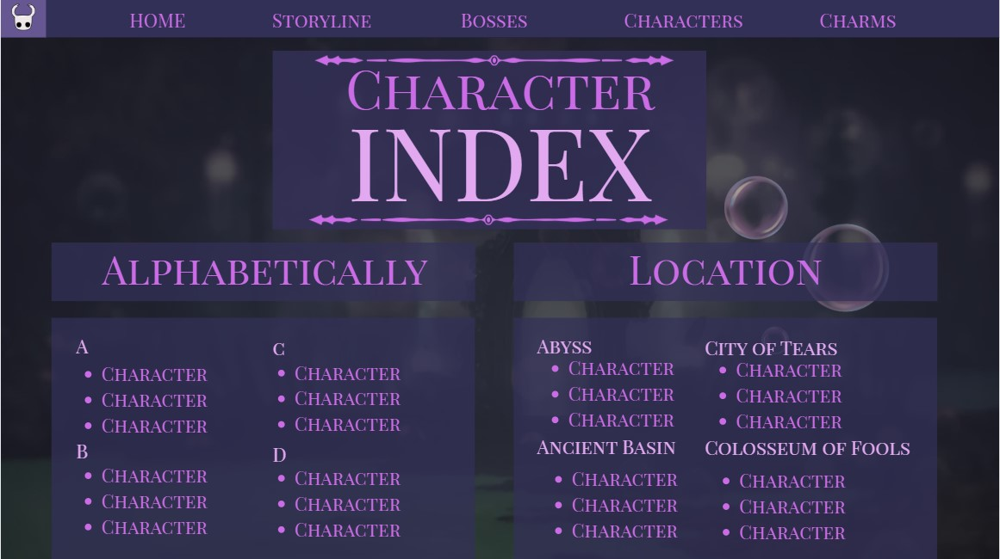
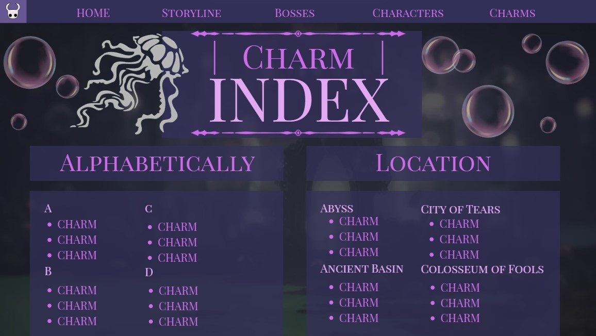
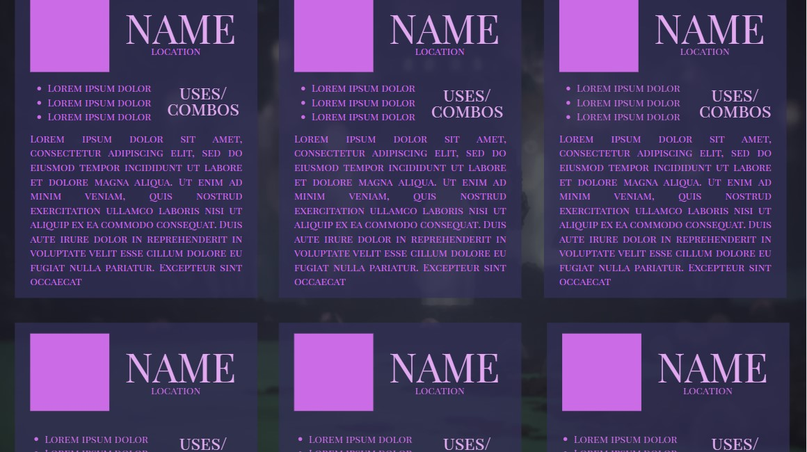
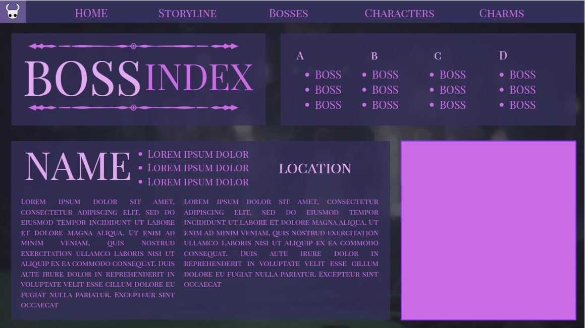

# WDProjBerylliumCabreraComia 
## Q2 Project Proposal
### 1. Working Website Title: The Dreamer's Archive
### 2. Second Title: Encyclopedia of Hallownest
### 3. Favicon: 

### 4. Website Overview: 
- This website, The Dreamer's Archive, is a comprehensive guide about the hit game Hollow Knight, made by indie video game developer Team Cherry. The Dreamer's Archive will contain useful and in-depth information about a large majority of the content in the game. This website includes info about the storyline, the bosses. the characters and their locations, and the charms. This website aims to help new players with their journey across the expansive world of Hollow Knight, or perhaps even help veteran players learn something new about the game that they haven't discovered. The Dreamer's Archive is made by Hollow Knight fans, for Hollow Knight Fans.
### 5. Website Outline:
- **Homepage:** 
> The homepage will just be a simple menu, including the description of the website, and easy navigation to the other webpages.  
- **Storyline**
> The storyline page will contain a simple timeline containing the beginning, the history of Hallownest (the location where the game takes place), the present, and the end of the Hollow Knight storyline. 
- **Boss Index**
> The bosses index page will contain an index of many details about the bosses of the game. It will contain their locations, weaknesses, and effective charm combos against them.
- **Character Index**
> The character index page will contain detailed information about the many notable characters you encounter in the game. It will include where you can find them, what they do, and some of their lore.
- **Charm Index**
> The charm index page will contain an index of all of the charms in the game, and it will include all the details about what they do, how to obtain them, and how they can be used efficiently. It will also include the many charm combos you can do. 
### 6. How Javascript Will Be Incorporated: 
- Javascript will be incorporated in the Character, Boss, and Charm Index. For easier browsing through these indexes, each of these webpages will have a filter system using Javascript. Characters, Bosses, and Charms will be split by and grouped according to certain broad categories or traits, and the user can filter out for these categories. For example: The Bosses in the Bosses page will be split according to easy difficulty, moderate difficulty, and hard difficulty. The user can filter out for each of these difficulties.
### 7. Wireframe:
- [Link to Full Wireframe (Made using Canva)](https://www.canva.com/design/DAG2-C6AFNo/IvwIGROKGSOj-9E5tISQhg/edit?utm_content=DAG2-C6AFNo&utm_campaign=designshare&utm_medium=link2&utm_source=sharebutton)
#### Homepage

#### Storyline

#### Characters 

#### Charms

#### Bosses
